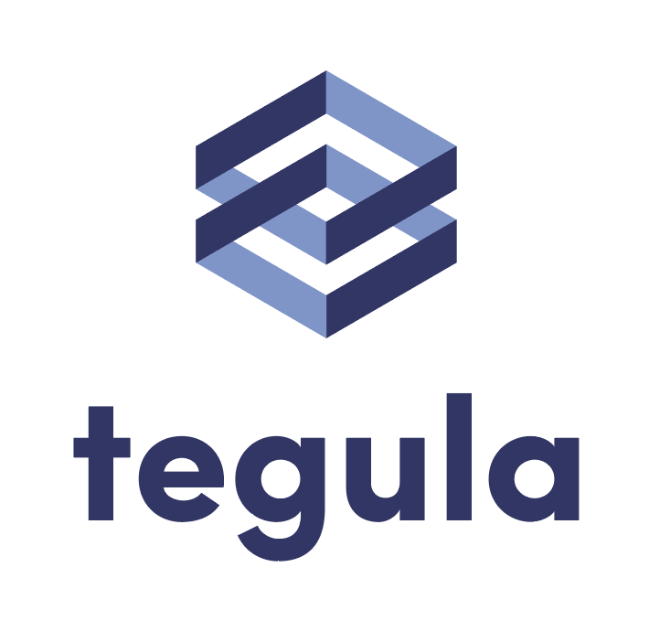

<!--  -->

# Tegula

Tegula is a low level abstraction layer for securely decentralizing the world's listing data, developed and maintained by [imbrex](https://imbrex.io). The core of the package is three main classes:

1. `Decentralizer`: the raw connection layer enabling adding and retrieving data directly to IPFS as well as in a structured event log via OrbitDB on IPFS
2. `Encrypter`: the encryption layer that securely encrypts/decrypts JSON data with a given key
3. `Identifier`: the identification layer for uniquely, and consistently, generating UPIs (Universal Property Identifiers) for listings based on their geo-coordinates

These three classes come together in the `ListingController` and then abstracted one step further in the `Tegula` class (which is what gets exposed by default). At the `Tegula` level the three agnostic classes listed above are wrapped in listing-specific logic that enables the easy addition and retrieval of listings given a user address and an encryption key.

---

## Installation

This package can be install via [npm](https://www.npmjs.com/package/tegula)

```bash
npm install --save tegula
```

---

## Basic Usage

#### Initialize

```js
// import the package
const Tegula = require("tegula");
// setup a new class instance
const tegula = new Tegula();

// initialize everything
tegula.initialize().then(() => {
  // now you're good to go!
});

// OR if you're inside an async method already
await tegula.initialize();
```

#### Set Address and Encryption Keys

```js
// ...

tegula.initialize().then(async () => {
  await tegula.setUserAddress("0xAbC...");
  await tegula.setEncryptionKey("some-encryption-key");
});
```

#### Add a Listing

```js
// ...

tegula.initialize().then(async () => {
  // ...

  const listingData = { latitude: 123.456789, longitude: 123.456789, ... };
  await tegula.addListing(listingData);
});
```

#### Fetch Listings for a given Address

```js
// ...
tegula.initialize().then(async () => {
  // ...

  // Option 1: use previously set encryption key and user address values
  const listings = await tegula.getListings();
  // Option 2: pass in one-time use
  const listings = await tegula.getListings("some-encryption-key", "0xAbC");
});
```

For a more complete list of available methods, visit [API.md](API.md)

---

## Dependencies

- [Crypto-JS](https://www.npmjs.com/package/crypto-js) - node `crypto` library universally available and used here for encryption
- [IPFS](https://ipfs.io) - decentralized file storage
- [OrbitDB](https://github.com/orbitdb/orbit-db) - database methods atop IPFS
- [Web3](https://github.com/ethereum/web3.js/) - Ethereum wrapper used here for address validation and sha3 hashing

## DevDependencies

- [Babel](https://babeljs.io/) - ES2015 transpiling
- [Eslint](https://eslint.org/) - linting
- [Gulp](https://gulpjs.com/) - build tools for packaging
- [Mocha](https://mochajs.org/) - unit testing
- [Prettier](https://prettier.io/) - opinionated code formatting

---

## Project Structure

This project is split into a few main directories:

1. `dist/` - this is where the actual built and minified files live
2. `examples/` - some quick example files for using the various classes
3. `src/` - the raw source code
4. `test/` - unit tests for everything in `src`

```
├── .cicleci/
├──── config.yml
├── dist/
├── examples/
├──── decentralizer.example.js
├──── encrypter.example.js
├──── identifier.example.js
├──── tegula.example.js
├── node_modules/
├── src/
├──── decentralizer.js
├──── encrypter.js
├──── identifier.js
├──── index.js
├──── listing-controller.js
├──── tegula.js
├── test/
├──── _setup.js
├──── decentralizer.test.js
├──── encrypter.test.js
├──── identifier.test.js
├──── listing-controller.test.js
├──── tegula.test.js
├── .eslintignore
├── .eslintrc.json
├── .npmignore
├── .prettierrc
├── API.md
├── guplfile.js
├── LICENSE
├── package-lock.json
├── package.json
├── README.md
```

---

## Tests

Every logic file in the `src/` directory has a corresponding test in the `test/` directory. Each method is unit tested which consequently results in cross-class integration tests with the `Tegula` and `ListingController` class tests.

```bash
npm test
```
